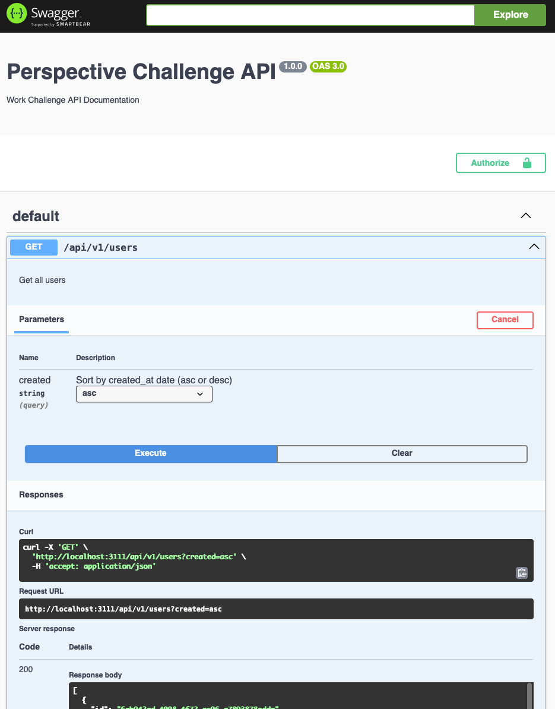

# Backend Engineer Work Sample

This project skeleton contains a basic Express setup one endpoint to create a user and one endpoint to fetch all users, as well as a basic empty unit test.

[](https://github.com/Traxmaxx/perspective-challenge/actions/workflows/node.js.yml)


### Goals
1. Adjust POST /users that it accepts a user and stores it in a database.
    * The user should have a unique id, a name, a unique email address and a creation date
2. Adjust GET /users that it returns (all) users from the database.
   * This endpoint should be able to receive a query parameter `created` which sorts users by creation date ascending or descending.

Feel free to add or change this project as you like.

## Table of Contents

- [Architecture overview](#architecture-overview)
- [Installation](#installation)
- [Usage](#usage)
- [Scripts](#scripts)
- [Migrating the database](#migrating-the-database)


### Architecture overview

I use Swagger for OpenAPI documentation and manual testing. You can start the API and navigate to `http://localhost:3111/swagger` to try out the different API calls.



Database migration is handled with [MikroORM](https://mikro-orm.io/), which supports appropriate alternatives for the SQLite adapter. It’s also straightforward to implement pagination if the number of returned users starts to grow.

Tests are handled with ts-jest. I use an in-memory DB to test the controller, with an in-memory database used to test the controllers. Ideally, this setup should be further abstracted depending on the frameworks or libraries in use. The API is being deployed through a docker container. The `node.js.yaml` pipeline config takes care of creating an image per PR and another one for PRs merged into main. If you use docker and want to watch new builds with [watchtower](https://github.com/containrrr/watchtower). This should be replaced with whatever is actually being used in production. I added a tiny `/health` endpoint for monitoring purposes.

There is a simplified environment setup for development and testing purposes. For production something like [encryption for dotenv](https://dotenvx.com/docs/quickstart/encryption) or some other [alternatives](https://developer.hashicorp.com/vault) should be found.

If I had more time and it would be a real project it makes sense to look further into the validation topic and the Swagger Docs generation.

Currently, the Swagger docs need to be inlined for swagger-autogen. This is necessary to ensure that the API documentation is generated correctly and reflects the current API state. Some frameworks like Next.js or tsoa provide better support for automatic documentation generation which allows for less repetition (DRY).

The validations are being done manually but should be replaced with something like [zod](https://www.npmjs.com/package/zod) or [ajv](https://www.npmjs.com/package/ajv). There would also be a [swagger-zod](https://www.npmjs.com/package/@kubb/swagger-zod) integration so we could define our validation schema once and generate the swagger docs from that.

In production sqlite should be replaced with a proper DB like PostgreSQL. The API should already support that via `mikro-orm.config.ts` by replacing the sqlite provider with any of [these](https://mikro-orm.io/docs/recipes). Migrations should be run as a separate job and not during server start. This was done for simplicity reasons to make sure the docker container demo works.

Last but not least authentication should be implemented to secure the API endpoints and manage potential user sessions effectively.

#### Project Structure

```plaintext
.
├── src
│   ├── controllers         # All Controllers
│   ├── migrations          # Migrations and schema managed via MikroORM
│   ├── entities            # All the database entities for MikroORM
│   ├── routes              # The internal sub page routing tables mapping the controllers to a path
│   ├── seeders             # Seed files for the DB managed via MikroORM
│   ├── types               # All reusable custom types go here
│   ├── app.ts              # Entry point for the API with all the routes and AdminJS config
│   ├── index.ts            # Entry point for the server and docker container
│   ├── mikro-orm.config.ts # The config for MikroORM
│   ├── setupTestEnv.ts     # We need to mock some things and handle server start/stop and the memory db stuff, this happens here
├── test                    # Tests go in here reflecting the structure of /src
│   └── ...
├── dist              # Compiled JavaScript files
├── package.json      # Project configuration and dependencies
├── tsconfig.json     # TypeScript configuration
├── eslint.config.js  # ESLint configuration
└── jest.config.js    # Jest configuration
```

## Installation

To get started you need to run NodeJS LTS 22 and have git installed. If that's the case, clone the repository and install the dependencies:

```bash
git clone git@github.com:traxmaxx/perspective-challenge.git
cd perspective-challenge
npm install

```

This takes a while doing it initially. You can also just run `npm ci` and do not do any minor updates.


## How to run the API

First time users need to setup the db and migrate first. Copy the `.env.example` to `.env` and adjust values accordingly and then run:

```bash
 npx mikro-orm-esm migration:up
```

To run the application in **development** mode after you set up the database and environment variables run:

```bash
npm run dev
```

To build the application for **production**:

```bash
npm run build
```

and then to run it in prod mode do:

```bash
node dist/server.js
```


## Scripts 
- `npm run build` Transpile the app,
- `npm run start`: Start the transpiled app from dist folder 
- `npm run startBundledDev`: Start the transpiled app from dist folder in dev mode,
- `npm run dev"`: Start dev mode with file watcher,
- `npm run lint`: Run eslint,
- `npm run test`: Run ts-jest with debug output,
- `npm run test-ci`: Run ts-jest without debug output


## Migrating the database

After changing the entities, run this to create a migration:
`npx mikro-orm-esm migration:create`

After executing this command you should see pending migrations with
`npx mikro-orm-esm migration:pending`

To run the migration execute
`npx mikro-orm-esm migration:up`


## Run in production with dedeploy on docker push

Create the following `docker-compose.yml` and change `traxmaxx` with the name of your GitHub account if you're building it yourself:

```yaml
services:
  api:
    restart: unless-stopped
    image: ghcr.io/traxmaxx/perspective-challenge:latest
    ports:
      - "33000:3000"
    env_file: "api.env"
    extra_hosts:
      - "host.docker.internal:172.18.0.1"
  watchtower:
    restart: unless-stopped
    image: containrrr/watchtower
    volumes:
      - /var/run/docker.sock:/var/run/docker.sock
      - /root/.docker/config.json:/config.json
    command: --interval 30
```

Create an env file called `api.env` next to your `docker-compose.yml`. This file should contain all necessary environment variables. Check .env.example for what is defined as a default and check if that works for you.